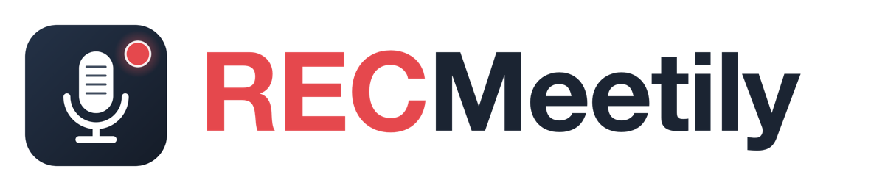

# RECMeetily

<p align="center">
  
</p>

A privacy-hardened, fully local meeting recorder for macOS Apple Silicon. Records meetings from the microphone and system audio (via Core Audio process tap) without bots or virtual drivers. Microphone and system audio are kept as separate tracks; microphone speech is labelled "You" and remote voices become "Speaker N" via on-device diarization. Transcription with Parakeet (25 European languages, automatic switching) or whisper.cpp (via Metal/CoreML). Local LLM summaries via bundled llama.cpp sidecar or your chosen cloud provider.

## Why This Fork

RECMeetily grew out of Meetily - Actually Free to deliver a macOS-focused privacy-hardened recorder:

- **No telemetry, no updater, no network exposure:** The app never contacts GitHub or any cloud service unless you explicitly add an API key. No auto-updater; no analytics module.
- **Hash-verified downloads:** Every model and binary (Parakeet, Whisper, summary GGUF, diarization, ffmpeg) is verified against SHA-256 hashes embedded in the app.
- **Content-free logs:** Logs never contain spoken text, summaries, or personally identifiable information.
- **Bundled ffmpeg only:** The sidecar is the exclusive ffmpeg source; system PATH is never consulted.
- **Microphone and system audio separation:** Kept as separate MP4 tracks before diarization, enabling precise speaker attribution.

## Features

- **Speaker-aware transcripts:** Microphone speech stays "You"; remote voices become "Speaker 1", "Speaker 2", etc.; overlapped speech renders as "You + Speaker 1".
- **Separate mic and system audio:** Retained as `mic.mp4` and `system.mp4` alongside the mixed playback track `audio.mp4`.
- **Parakeet or Whisper transcription:** Parakeet TDT 0.6B v3 (NVIDIA, ONNX) for live and post-call with 25 European languages and automatic language switching; whisper.cpp for post-call retranscription with Metal/CoreML acceleration and vocabulary hints.
- **Local diarization:** On-device speaker identification via pyannote segmentation 3.0 + WeSpeaker ResNet34 embeddings (ONNX Runtime, no external API).
- **Local LLM summaries:** Bundled llama.cpp sidecar with Metal support; Qwen 3.5 (2B/4B) or Gemma 3 (1B/4B) models; or bring your own provider (Ollama, OpenAI, Anthropic, Groq, OpenRouter, any OpenAI-compatible endpoint).
- **Automatic meeting detection:** Watches for Zoom, Teams, Slack, Webex, and other meeting apps; prompts to start recording.
- **Live audio levels:** Separate microphone and system meters show pre-mix activity during recording.
- **Floating recording bar:** Compact minibar with timer and pause/resume/stop controls.
- **Meeting memory:** Global search, reusable people profiles, speaker naming, and person Q&A.
- **Native exports:** PDF, DOCX, Markdown, JSON, and clipboard.
- **Automatic post-call processing:** Retranscribes retained source tracks independently, diarizes, and optionally summarizes.
- **Custom summary templates:** Define your own summary structure and ask custom questions.
- **Dark and light themes:** Cohesive theming across recording, transcripts, summaries, and settings.

## Requirements

- **macOS 14.2 or later** (Sonoma or newer) on Apple Silicon (M1 or newer).
- **Microphone and System Audio Recording permissions.** Prompted on first use.
- **Internet connection:** Required only for downloading models (first launch) and, optionally, cloud providers if configured.

## Install

RECMeetily is distributed as a DMG on the [releases page](https://github.com/felipecortesp/RECMeetily/releases). Installation takes a few extra steps compared with an App Store app, for one reason: **the build is not signed or notarized by Apple.** Notarization requires a paid Apple Developer account, and this project does not have one. macOS therefore treats the app as unverified the first time it runs. Everything below can be done by any user without administrator tools; if you prefer, you can also [build the app from source](#build-from-source) on your own Mac, in which case macOS does not block it at all.

### 1. Copy the app to Applications

1. Download `RECMeetily_<version>_aarch64.dmg` and double-click it.
2. The DMG window shows only `RECMeetily.app`. Open a second Finder window on Applications (press Cmd+Shift+A) and drag `RECMeetily.app` into it. Opening the app directly from the DMG window does not install it.
3. Eject the DMG (the RECMeetily disk in the Finder sidebar).

### 2. Allow the first launch (Gatekeeper)

1. Open RECMeetily from Launchpad or Spotlight. macOS shows "RECMeetily.app Not Opened: Apple could not verify..." Click **Done**.
2. Open **System Settings > Privacy & Security**, scroll down to the **Security** section. Next to the message about RECMeetily, click **Open Anyway** and confirm with your password or Touch ID.
3. Open RECMeetily again. macOS asks one last time; confirm. This happens only once per version.

Terminal alternative, same result: `xattr -dr com.apple.quarantine /Applications/RECMeetily.app`.

### 3. First launch

On a fresh Mac the app shows a short setup that downloads the transcription model (Parakeet, about 670 MB) and the summary model (Qwen 3.5 4B, about 2.6 GB) from Hugging Face. Downloads are verified against SHA-256 hashes embedded in the app. If you previously used Meetily - Actually Free, its models and meetings are copied over automatically and the setup is skipped.

### 4. Permissions

RECMeetily needs two permissions, both asked on first use:

- **Microphone**: macOS shows a standard prompt; click Allow.
- **System Audio Recording** (to hear the other participants): if the app shows the banner "System Audio Permission Required", click **Open Audio Capture Settings**. macOS opens **System Settings > Privacy & Security > Screen & System Audio Recording**. In the **System Audio Recording Only** list, switch on **RECMeetily**. If it is not listed, click **+** and pick it from Applications.
- Then **quit RECMeetily completely (Cmd+Q) and open it again**: the permission is read only at launch.
- Play any audio (a video in the browser is enough) and click **Recheck** in the banner. The "System audio" indicator in the recording bar turns green.
- The system-audio tap only delivers data while something is playing; silence during a recording is normal and is recorded as silence.

No camera, screen content, location, contacts or calendar permissions are requested.

### Updating

Install the new DMG the same way; it replaces the app in Applications. Your meetings, settings and models are kept. Because each build is signed locally, macOS may ask again for the Open Anyway step and, occasionally, for the two permissions.

## Local Data

| Data | Location |
| --- | --- |
| Database, templates, models | `~/Library/Application Support/RECMeetily` |
| Recordings | `~/Movies/recmeetily-recordings` (configurable in Settings) |
| Playback and retained tracks | `audio.mp4` (mixed), `mic.mp4` (you), `system.mp4` (remote) |

On first launch, the app copies existing models and recordings from a previous Meetily installation (if present), leaving the original untouched.

## Privacy

- **No telemetry:** No analytics or usage tracking. Crash reports are written to a local file only and never sent.
- **No auto-updater:** Download updates manually from the GitHub releases page.
- **No backend:** Everything runs on your machine. There is no server, no cloud sync, and no account required.
- **Hash-verified downloads:** Every model and binary is verified against embedded SHA-256 hashes. Diarization models are fetched from pinned URLs and verified against SHA-256 hashes embedded in the app; see [docs/diarization-models.md](docs/diarization-models.md) for their provenance.
- **Content-free logs:** Logs never include transcripts, summaries, audio data, or other sensitive content.
- **Only bundled ffmpeg:** The app uses only its bundled ffmpeg sidecar; system PATH is never consulted.

## Build From Source

Requires: Xcode (full), Rust 1.97+, pnpm 12, Homebrew openssl@3.

1. Build the sidecar:

```bash
cargo build --release --package llama-helper --target aarch64-apple-darwin --features metal
cp target/aarch64-apple-darwin/release/llama-helper frontend/src-tauri/binaries/llama-helper-aarch64-apple-darwin
```

2. Build the frontend and package the app:

```bash
cd frontend
pnpm install --frozen-lockfile
pnpm exec tauri build --target aarch64-apple-darwin --bundles app
```

3. Create a DMG (optional):

```bash
hdiutil create -volname RECMeetily -srcfolder "<path to RECMeetily.app>" -ov -format UDZO RECMeetily.dmg
```

Environment variables:

```bash
export DEVELOPER_DIR=/Applications/Xcode.app/Contents/Developer
export MACOSX_DEPLOYMENT_TARGET=14.2
```

See [ARCHITECTURE.md](ARCHITECTURE.md) and [.github/workflows/MACOS_RELEASE.md](.github/workflows/MACOS_RELEASE.md) for more details.

## Acknowledgements

It grew out of [Meetily - Actually Free](https://github.com/TylerBuza/Meetily-ActuallyFree) by Tyler Buza, itself based on [Meetily](https://github.com/Zackriya-Solutions/meetily) by Zackriya Solutions. Thanks to both projects.

Security and bundling ideas came from [Talkkeeper](https://github.com/leyvanah/Talkkeeper): bundled-only ffmpeg, content-free logs, and removing dead backend commands.

Built with open-source models and engines:

- [Parakeet TDT 0.6B v3](https://huggingface.co/nvidia/parakeet-tdt-0.6b-v3) by NVIDIA; ONNX conversion by [istupakov](https://github.com/istupakov).
- [Whisper](https://github.com/openai/whisper) and [whisper.cpp](https://github.com/ggerganov/whisper.cpp) by OpenAI and ggerganov.
- [pyannote.audio](https://github.com/pyannote/pyannote-audio) for speaker segmentation.
- [WeSpeaker](https://github.com/wenet-e2e/wespeaker) for speaker embeddings.
- [llama.cpp](https://github.com/ggerganov/llama.cpp) by ggerganov.
- [Qwen](https://github.com/QwenLM/Qwen) by Alibaba and [Gemma](https://github.com/google/gemma) by Google for summary models.
- [Tauri](https://tauri.app) and [ONNX Runtime](https://onnxruntime.ai).

## License

MIT licensed. See [LICENSE.md](LICENSE.md). Original copyright notices and license terms from Meetily and Meetily - Actually Free are retained.
